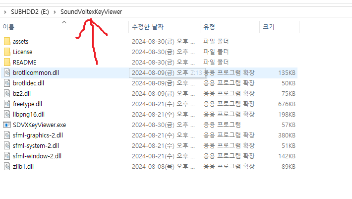
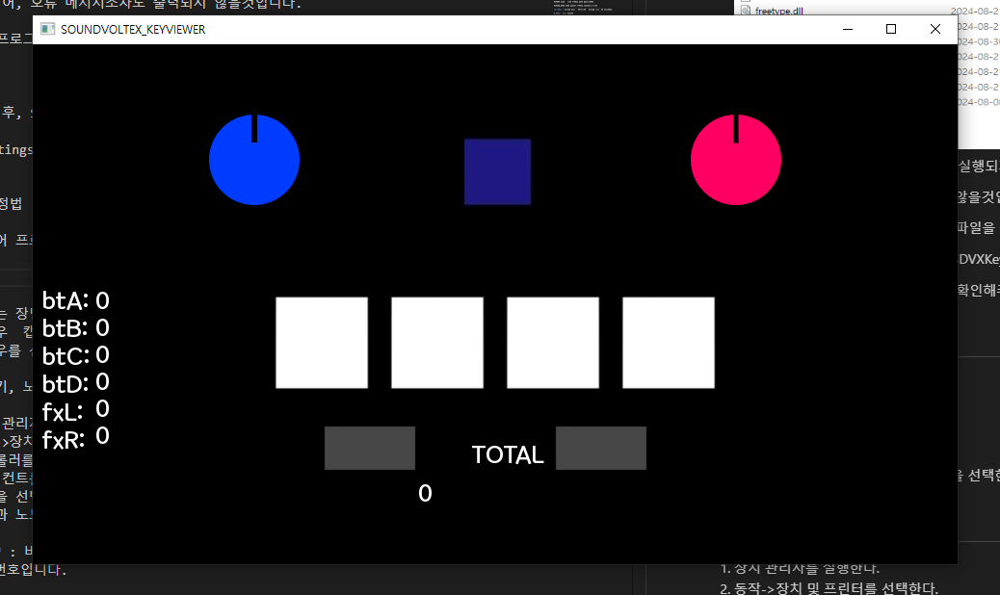
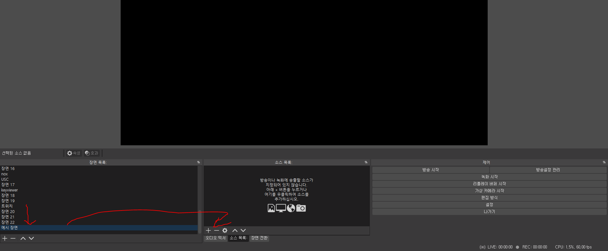
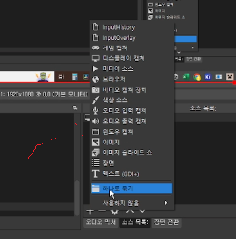
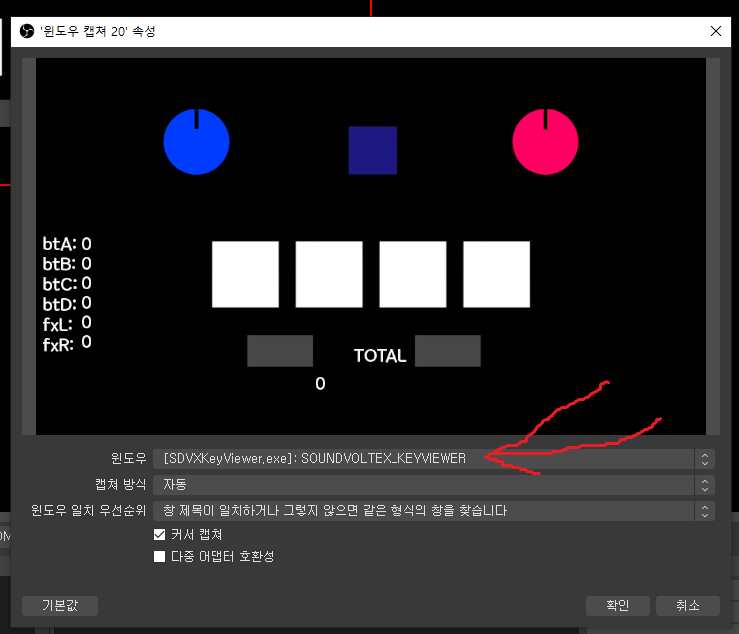
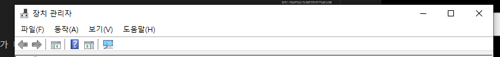
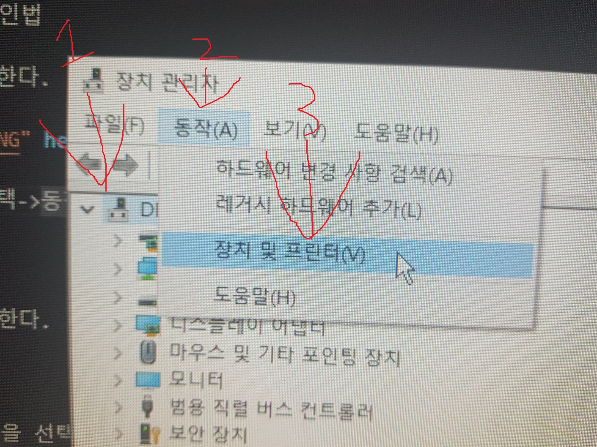
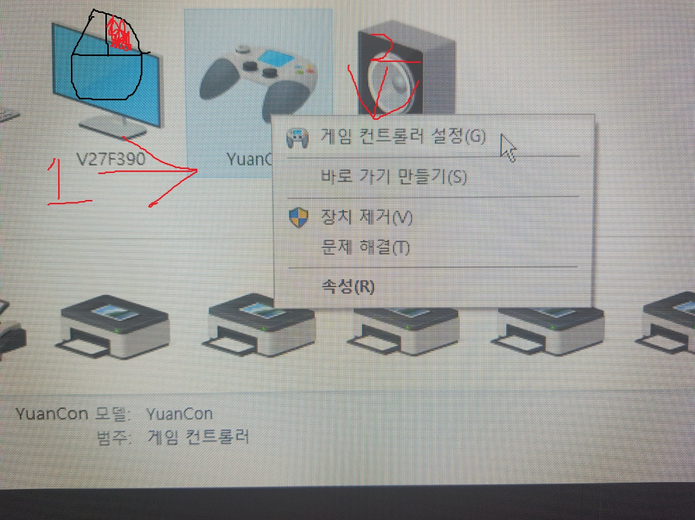
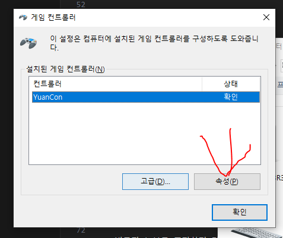
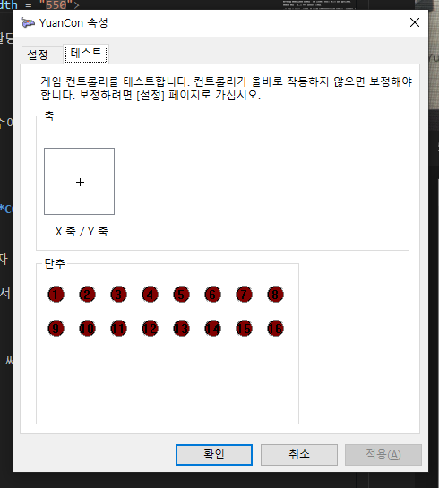

SoundVoltexControllerKeyviewer 사용설명서
==
1. 사용법
2. OBS설정법
3. 버튼 키, 노브 축 확인법
4. Settings.ini파일 설정법
5. 이미지 파일 수정법
6. 오류 메시지

1.사용법
--
1. **SoundVoltexKeyViewer 폴더에 SDVXKeyViewer.exe와 assets폴더, dll파일들을 배치해둡니다**
   
    

    이렇게 하지 않으면, 프로그렘 자체가 실행되지 않습니다.

    심지어, 오류 메시지조차도 출력되지 않을것입니다.

    본 프로그램은 해당 폴더를 기준으로 파일을 찾아가도록 작성되어있습니다.

2. 그런 후, Settings.ini파일을 설정하고 SDVXKeyViewer.exe를 실행합니다

    Settings.ini파일 설정법은 4번 문단을 확인해주세요

2.OBS설정법
--
1. 키뷰어 프로그램을 실행한다.
   

2. OBS를 실행한다

3. 원하는 장면에 있는 추가 버튼을 누른다.

4. 윈도우  캡쳐를 선택한다.

5. 윈도우를 선택하고, 키뷰어 프로그램을 선택한다.

3.버튼 키, 노브 축 확인법
--
1. 장치 관리자를 실행한다.

2. 아무런 항목이나 선택->동작->장치 및 프린터를 선택한다.

3. 컨트롤러를 우클릭 한다.

4. 게임 컨트롤러 설정을 선택한다.

5. 속성을 선택한다.

6. 버튼과 노브를 조작하며 각 버튼이 몇번에 할당되어있는지 확인한다.

**주의** : 버튼의 경우에는 속성에서 보이는 수에서 1을 뺀것이 프로그램에서 인식하는 버튼의 번호입니다.

4.Settings.ini파일 설정법
--
Settings.ini의 각 섹션에서 **BUTTONS**와 **CONTROLLER**는 **정수**로만 설정 가능하고,

**KNOBS**와 **WINDOW**는 문자(수 형태의 문자 포함)로 설정 가능합니다.

**단, KNOBS 섹션에서는 하단에 코드 이외의 값은 설정하면 안됩니다. 그리고 대문자 소문자도 정확히 지켜야됩니다**

~~~Ini
[BUTTONS]
BT_A = 1
; O
BT_B = A
; X
BT_C = 1A
; X
BT_D = l%23f
; X

[CONTROLLER]
CONTROLLER_INDEX = 0
; O
CONTROLLER_INDEX = e
; X
CONTROLLER_INDEX = 4f1A213
; X
CONTROLLER_INDEX = sdf+la%23f
; X

[KNOBS]
KNOB_L = X
; O
KNOB_L = x
; X
KNOB_L = xX
; X
KNOB_R = Xx
; X

[WINDOW]
WINDOW_NAME = 1
; O
WINDOW_NAME = =
; O
WINDOW_NAME = ~*(!#)*)hjkjlfnkjfsd
; O
WINDOW_NAME = <- any unicode character (유니코드 문자)
; probably X 아마도 X

~~~

BUTTONS와 KNOBS 섹션의 각 속성들은 3번 문단에서 확인한 값으로 설정 가능합니다.

KNOBS의 속성들은 다음과 같이 설정하면 됩니다.

만약 어느 한 노브를 돌렸을떄, 그 노브가 밑에 써져있는 축의 방향으로 움직인다면, 해당 축에 해당하는 문자를 적어주면 됩니다.

X축 => X
Y축 => Y
Z축 => Z
R축 => R
U축 => U
V축 => V

그 외에 PovX와 PovY도 있습니다.

CONTROLLER 섹션은 원하는 컨트롤러의 번호를 작성해주시면 됩니다.

만약 아무것도 연결된것이 없고, 사용을 원하는 컨트롤러 하나만 연결되있다면, 0을 입력하면 됩니다.

그 외의 사항은 컨트롤러가 한가지밖에 없어서 확인하지 못하였습니다

WINDOW 섹션은 창의 이름을 설정 가능합니다

WINDOW_NAME 키에 원하는 이름을 입력하여주세요

**주의** : 영어가 아닌 유니코드값은 오류가 발생할수 있습니다.

5.이미지 파일 설정법
--
imgs 폴더의 Images.png 파일을 수정하면 버튼과 노브에 스킨을 씌울수 있습니다.

현제 본 프로그램에 사용되는 이미지들은 모두 기본적으로 **100x100**크기를 가지고, 그 이미지들을 모아서 한장의 Image.png로 만들어, 100x100 범위를 지정해 그 구역 안에서 특정 부분만 로드해오는식으로 사용됩니다.

상단 이미지에서 볼수 있듯이 , 사용되는 모든 이미지들은 100x100범위(노란색 박스와 숫자로 표시된 범위)를 할당받고, 해당 범위 안에서 그려지며, 해당 범위 안에서 특정 범위(녹색 숫자로 표시된 범위값)만큼 로드되어 사용됩니다.

다시말해서, Images.png안의 이미지들을 크기와 원레 위치에 맞춰서 사용자가 다른 이미지를 집어넣어서 수정하면, 프로그램에 표시되는 이미지를 바꿀수 있는것입니다.

6.오류 메시지
--
만약 프로그램이 실행되지 못하고 꺼졌다면, Logs폴더에서 오류 메시지를 확인할수 있습니다.

각 오류 메시지의 의미는 다음과 같습니다

1. ERROR IN LOAD FILE => assets폴더를 찾지 못했거나, 해당 폴더에 자료들이 유실 또는 손상되었거나, 이름이 올바르지 않을때 발생합니다

2. ERROR IN CONTROLLER CONNECTION => Settings.ini 파일에 설정한 컨트롤러에 인덱스에 해당하는 컨트롤러의 연결을 감지하지 못했을때 발생합니다.

ERRORS.txt은 프로그램이 삭제하지 않습니다. 